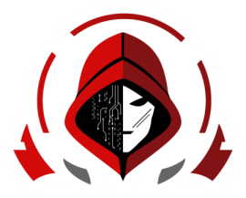

<div align="center">
  

# Cybersen Forge

**Command & Control Console**
Equipo **Cybersen** · Operador **TonyTrapper**

[](https://github.com/TonyTrapper/Cybersen-Forge/actions/workflows/build-agents.yml)

</div>

Cybersen Forge es una plataforma C2 desarrollada para el reto insignia **«Forja tu Yugo»** del SecOpsDays CTF 2026. Integra un servidor web, tablero multi-sesión y agentes reproducibles para Linux y Windows.

## Capacidades actuales

- Login de operador y NONCE visible en el tablero.
- Inventario multi-sesión con estados `online`, `idle` y `offline`.
- Consola por sesión con actualización en tiempo real mediante Server-Sent Events.
- Ejecución de tareas, captura de `stdout`, `stderr`, exit code, duración y timestamps.
- Historial persistente de tareas con copia de resultados.
- Implant Linux y Windows desde un único código Go.
- Base SQLite persistente mediante volumen de Docker Compose.
- Compilación automatizada de agentes con GitHub Actions.
- Arquitectura preparada para incorporar relay/pivote en la siguiente fase.

## Arquitectura

```text
                         Internet / laboratorio
                                  │
                                  ▼
                      ┌──────────────────────┐
                      │ Cybersen Forge       │
                      │ FastAPI + SQLite     │
                      │ Dashboard web        │
                      └──────────┬───────────┘
                                 │ HTTPS / polling
                 ┌───────────────┴───────────────┐
                 ▼                               ▼
       Linux implant                    Windows implant
```

Más detalles en [`docs/architecture.md`](docs/architecture.md).

## Inicio rápido

### 1. Configurar el servidor

```bash
cp .env.example .env
```

Genera secretos independientes:

```bash
openssl rand -hex 24
openssl rand -hex 32
openssl rand -hex 32
```

Actualiza como mínimo:

```env
TEAM_NONCE=NONCE-REAL-DEL-EQUIPO
OPERATOR_PASSWORD=...
SESSION_SECRET=...
AGENT_ENROLLMENT_TOKEN=...
```

### 2. Levantar Cybersen Forge

```bash
docker compose up --build -d
docker compose ps
```

Dashboard local:

```text
http://127.0.0.1:8000
```

### 3. Compilar los agentes

```bash
make agent-linux
make agent-windows
```

Artefactos generados:

```text
bin/cybersen-forge-linux-amd64
bin/cybersen-forge-windows-amd64.exe
```

## Implant Linux

```bash
export FORGE_SERVER='http://127.0.0.1:8000'
export FORGE_ENROLLMENT_TOKEN='EL_TOKEN_DE_TU_ENV'
./bin/cybersen-forge-linux-amd64
```

## Implant Windows

```powershell
$env:FORGE_SERVER = "http://IP-DEL-SERVIDOR:8000"
$env:FORGE_ENROLLMENT_TOKEN = "EL_TOKEN_DE_TU_ENV"
.\bin\cybersen-forge-windows-amd64.exe
```

## Pruebas

```bash
make test
```

## Identidad visual

La paleta, usos del logo y lineamientos de interfaz están documentados en [`docs/branding.md`](docs/branding.md).

## Roadmap del reto

- [x] Código público y documentación reproducible.
- [x] Implant Linux con sesión recibida.
- [x] Implant Windows compilable como `.exe`.
- [x] Ejecución de tareas y visualización del output.
- [x] Tablero multi-sesión.
- [ ] Relay autenticado para máquina interna sin egress.
- [ ] Exportación de evidencias para el walkthrough.

## Uso autorizado

Este proyecto se publica para laboratorios propios, CTF y entornos expresamente autorizados. Consulta [`SECURITY.md`](SECURITY.md) antes de desplegarlo.

## Licencia

BSD 2-Clause. Consulta [`LICENSE`](LICENSE).
